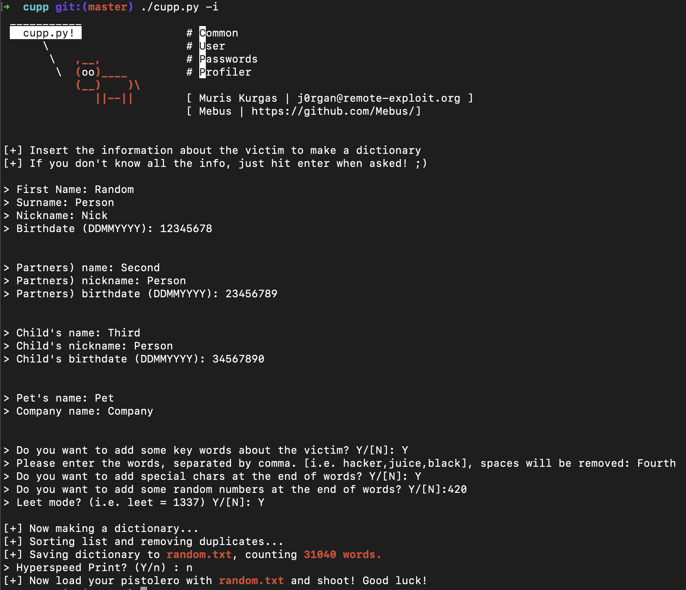

# CUPP - Common User Passwords Profiler
By Kevin Wang, Daniel Liu  
Period 3

## Show of Hands
Who here has ever created a password that included any one of these:
* Your name?
* Nickname?
* Birthdate?
* Pet name?

The average user does this too.

## Your password is vulnerable
Probably not to rockyou.txt, but a `custom password list` that hackers can tailor to your data.

## How do hackers exploit this?
[CUPP](https://github.com/Mebus/cupp) is a tool that creates custom wordlists using your personal information. It stands for Common User Password Profiler.
=

## Installation
Requirement: `Python 3`

Kali Linux:
```
$ sudo apt install cupp
```

Other:

```
$ git clone https://github.com/Mebus/cupp.git
$ cd cupp/
```

## Using CUPP
CUPP is a command line script that provides an interactive mode that allows you to easily input data about your victim:

```
$ python3 cupp.py -i
```



When running in the interactive mode, you can provide details about the victim:

* name
* nickname
* birthdate
* partner info
* child info
* pet name
* company name
* keywords associated with them

Note that any information that you leave blank will not be reflected in the final wordlist.

## Demo
Are there any volunteers willing to fork up their personal data?

### CLI
Showcase how to use CUPP in the command line

### CLIs are cool and all...
But we created a [CUPP web app]() to streamline the process.

## How does CUPP work?
In order to understand this, we can use the default options to make it easier to visualize.
```
chars= !, @, #, $, %%, %, *
years = 1990, 1991 ... 2003, 2004, 2005
numRange = 0, 100
wcRange = 5, 12
```

1. First, random combinations of the previously specified default chars were generated and added to a list.
2. Then, splices of relevant words were generated and also added to a list. These include, but are not limited to: last 2 of birth year, birth year, day/month of birthday. This process was generated for each person (target, partner, child)
3. The birthday splices for each person were combined individually, in pairs, and in triplets.
4. For each relevant name (like target surname, pet name, and company name), they were all capitalized. Relevant names were also reversed. Then, they were added to lists for each person.
5. The following two functions (concats and komb) were used to add numbers to each word as well as generate combinations of the words with the specified delimiter.

In summary, CUPP works by taking the information of the target and those they care about and generating as many of the possible combinations of that data (whether it is spliced, reversed, or capitalized) and putting that into a wordlist.

### Concatenations...
```py
def concats(seq, start, stop):
    for mystr in seq:
        for num in range(start, stop):
            yield mystr + str(num)
```
### Combinations...
```py
def komb(seq, start, special=""):
    for mystr in seq:
        for mystr1 in start:
            yield mystr + special + mystr1
```
### Leet Mode
```py
def make_leet(x):
    """convert string to leet"""
    for letter, leetletter in CONFIG["LEET"].items():
        x = x.replace(letter, leetletter)
    return x
```

## Lessons

### Data leaks can make your password vulnerable
Even if your password itself is not exposed, your personal data can be used to brute force your passwords.

### USE A PASSWORD MANAGER
Password managers are not susceptible to tailored passwords, among numerous other security benefits.

[Homework](https://github.com/Stuycs-K/final-project-3-wangk-liud/blob/main/HOMEWORK.md)